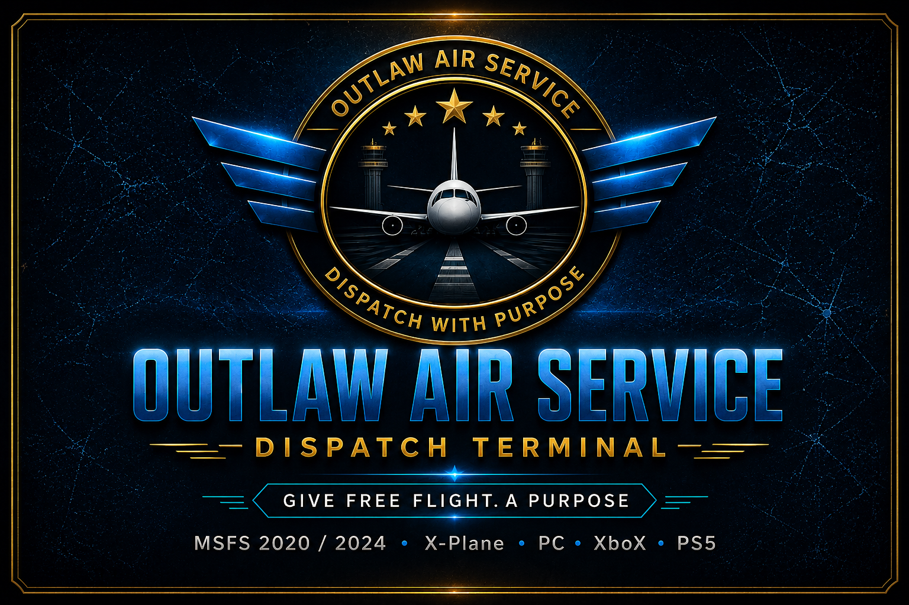

# Outlaw Air Service - Dispatch Terminal (Experimental)

**EXPERIMENTAL BUILD**

This is the active development sandbox. Features may change, saves may not be fully compatible with Stable, and things can break. Use at your own pace.

**This is experimental, but it is not random.**

**Current beta target: v0.6.7**

OAS Experimental is the current beta build for the next Dispatch Terminal release: actively tested, intentionally scoped, and guided by the core goal of giving Free Flight a purpose without turning it into a management sim.

For the stable, polished version visit the [main Outlaw Air Service repo](https://github.com/Anonymous-Guy777/outlaw-air-service-dispatch).

---

**Free Flight is great... until it isn't.**

Eventually it becomes:

**spawn -> fly -> land -> repeat**

No purpose. No pressure. No story.

**So I built this.**

A **free**, lightweight, browser-based **Operations Sandbox** that gives your free flights real dispatch structure and a personal flight journal without bloat, mods, or management sim overhead.

  

---

## Index

- [The Philosophy](#the-philosophy)
- [Regional DNA](#regional-dna)
- [Primary Flow: Pilot's Choice](#primary-flow-pilots-choice)
- [Cockpit Navigation](#cockpit-navigation)
- [How It Works](#how-it-works)
- [Company Setup](#company-setup)
- [What's New in Experimental](#whats-new-in-experimental)
- [Status](#status)
- [QA Checklist](#qa-checklist)
- [Save System](#save-system)
- [Feedback & Support](#feedback--support)
- [Disclaimer](#disclaimer)

---

**Works on:**

- MSFS 2020 / 2024 (PC)
- X-Plane (PC)
- PS5 & Xbox (via phone/tablet EFB)
- Any modern browser

**No mods. No plugins. No AI. No tracking.**

Pure honor system.

---

## The Philosophy

**OAS is an Operations Sandbox + Personal Flight Journal.**

**Pilot's Choice** is now the primary experience:

Build the exact flight or operation you want to fly, then let OAS wrap it in lightweight dispatch structure, timing, payouts, and logging.

**Operation Presets define the purpose of the flight, not the rules of the flight.**

They provide dispatch intent and operational flavor while keeping the route, aircraft, timing, risk, and final decisions fully pilot-controlled.

It's still 100% honor-based. You are Pilot in Command. Fly clean, earn it. Fly sloppy, own it.

OAS also includes a lightweight built-in **Operation Timer** designed for tablet/EFB-style flying. Start the timer when your operation begins, pause it anytime, and complete the operation manually when finished. The target can be manually adjusted for multi-hop flights, fuel stops, or RON logistics. The timer is fully honor-system based and designed for immersion, not enforcement.

---

## Regional DNA

OAS currently gives the Pacific Northwest / Oregon region extra operational density because it naturally fits the kind of flying this sandbox was built around: mountains, forests, valleys, coastal weather, fog, rain, snow, desert edges, IFR conditions, Night Ops atmosphere, short strips, regional airports, cargo-capable runways, medevac-style hops, scenic routes, and compact operational distances.

That makes it a strong default sandbox for bush ops, cargo runs, medical relief, mountain flying, weather operations, scenic touring, and regional hops.

This does **not** limit OAS to the Pacific Northwest. **Pilot's Choice remains worldwide:** fly Japan, South America, Alaska, Europe, the Philippines, or anywhere your sim and imagination can support. International regions remain available as lighter flavor-expansion layers while the default pools keep OAS's PNW/Oregon operational DNA.

---

## Primary Flow: Pilot's Choice

**Start here.** Create the operation you actually want to fly.

- Choose any route
- Pick your aircraft
- Set operation intent and risk
- Add optional notes / memo

OAS turns it into a proper dispatch card with EFB timer target, estimated payout, and logging.

Current Operation Types: Airshow / Demo, Bush / STOL, Cargo, Ferry / Positioning, Firefighting, Medevac, Oddball / Custom Ops, Scenic / Tourism, Search and Rescue, Skydiving, Training / Checkride, and VIP Charter.

**Quick Contract** and **5-Job Board** are still available as "surprise me" options lower down.

---

## Cockpit Navigation

The top cockpit buttons follow the normal operation sequence:

1. **Pilot's Choice** - build or choose the operation
2. **Dispatch** - review the active EFB Dispatch Card
3. **Aircraft** - assign or compare aircraft after a dispatch exists
4. **Score** - review bonuses, penalties, costs, and closeout flow

The later buttons are dimmed until they apply. Aircraft unlocks after a dispatch exists; Score unlocks after an aircraft is assigned.

---

## How It Works

1. **Create Operation** (Pilot's Choice)
2. Review your EFB Dispatch Card
3. Fly the operation in Free Flight (use the target time or optional OAS Operation Timer)
4. Complete honestly: apply bonuses/penalties
5. Log the flight with optional memo
6. Watch your outlaw career and journal grow

---

## Company Setup

Company Setup adds a lightweight persistence layer to your OAS sandbox without turning the app into a management sim.

You can customize:

- **Company Name** - your operational identity
- **Home Base** - default fleet location and return hub
- **Insurance** - optional per-flight cost that lowers maintenance-hit risk
- **Crew Passive Income** - small once-per-real-day support income based on fleet size/value after upkeep
- **Set Fleet Location to Home Base** - quick operational reset for your fleet

These systems are intentionally lightweight and honor-system based. Their purpose is to support atmosphere, organization, and operational continuity, not grind, spreadsheets, or deep management mechanics.

The Aircraft Market is intentionally small and representative. Pick the closest suitable aircraft for your fleet, buy multiples when you want a larger operation, or use Pilot's Choice Manual Entry for add-ons, mods, and aircraft not listed.

---

## What's New in Experimental

- **Pilot's Choice** promoted as the main flow
- Expanded manual / sandbox operation creation
- Global Operation Presets for lightweight dispatch intent, not scripted rules
- Grouped MSFS aircraft selector with session-only Manual Entry override
- User-adjustable EFB target timing for multi-hop, fuel stop, and RON logistics
- **Working pilot-controlled Operation Timer** with start, pause, resume, reset, completion, and Flight Log time capture
- Flight Memo notes, Notable Flights, and Print/Copy Log tools
- Atmospheric dispatch flavor lines and pilot-facing aircraft notes
- No external aircraft/airport data pages required
- PNW/Oregon regional DNA clarified while preserving worldwide Pilot's Choice freedom
- Updated metallic gold/navy branding
- Stronger Operations Sandbox direction

---

## Status

**Experimental - Operations Sandbox**

Phase 2 identity refinement is settling into polish and QA. Future work should prioritize workflow checks, wording consistency, mobile/tablet usability, Dispatch Card clarity, Flight Log readability, and immersion cleanup while protecting the core KISS experience.

**Future lightweight directions:** curated Historic / Legendary operation flavors, regional airport pools, aircraft identity bonuses, simple multi-leg operations, relaxed/untimed modes.

---

## QA Checklist

Testing the Experimental build? Use the [OAS QA Checklist](data/OAS_QA_CHECKLIST.md) to verify operational flow, timer behavior, payouts, presets, Flight Log entries, save/restore behavior, mobile readability, and regression risks.

---

## Save System

Export / Import anytime.

**Always back up before testing big changes.**

---

## Feedback & Support

Found a bug or have thoughts? Open an issue or drop feedback where you found the project.

Support future development: [Ko-fi - wacky_outlaw](https://ko-fi.com/wacky_outlaw)

---

## Disclaimer

Not affiliated with Microsoft Flight Simulator, Asobo, Laminar Research, or X-Plane.

---

**Built for pilots who just want to fly with purpose.**

---

*Experimental repo for testing new ideas before they reach the stable build.*
