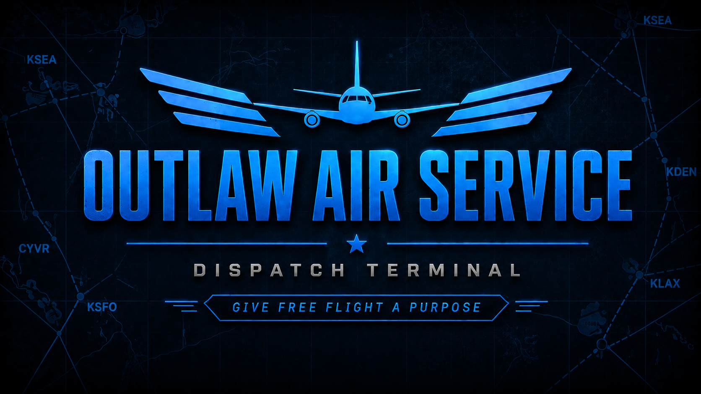
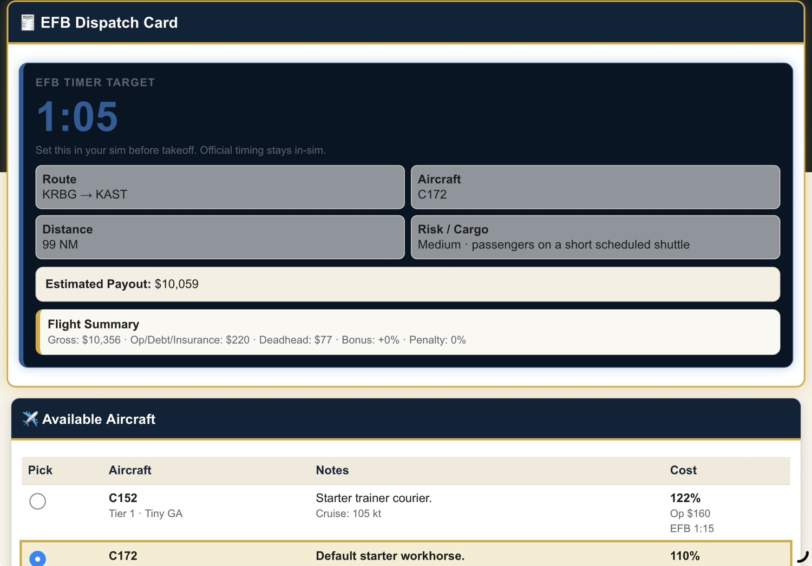
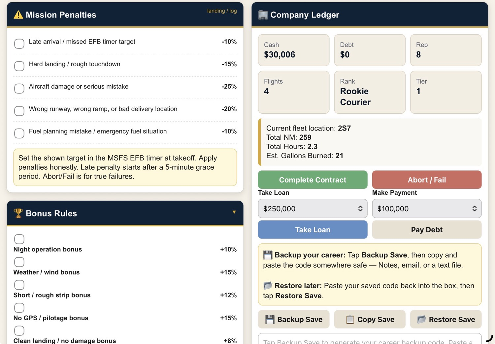
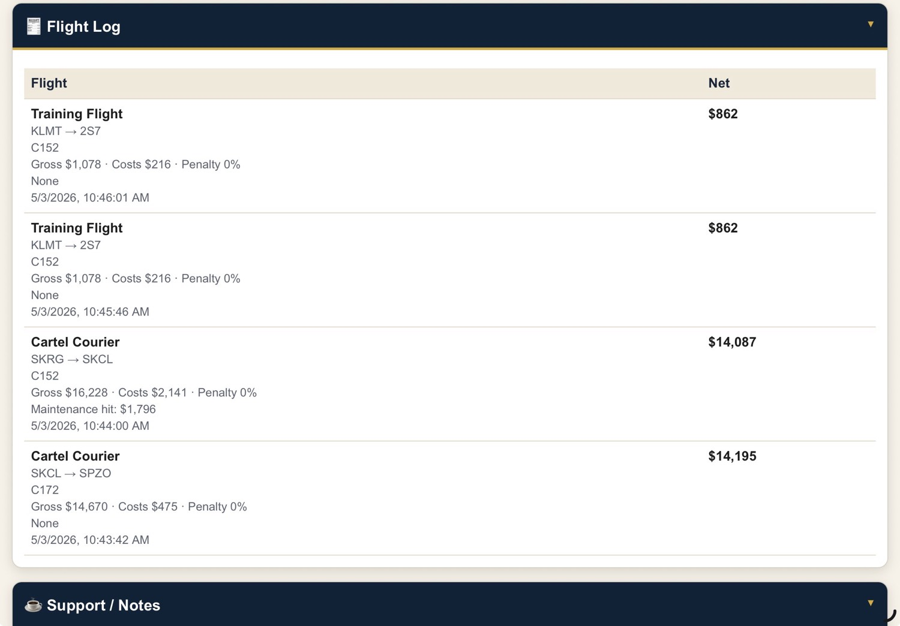

# ✈️ Outlaw Air Service — Dispatch Terminal (MSFS 2020 / 2024 • X-Plane • Console & PC)

**Free Flight is great… until it isn’t.**

At some point it just turns into:  
spawn → fly → land → repeat  

No purpose. No pressure. No reason to care.

**So I built this.**

A **FREE**, lightweight, browser-based dispatch tool that gives your flights real structure — without turning it into a grind.

  
  &nbsp;&nbsp;&nbsp;
  

👉 **Launch the Dispatch Terminal and start your first contract:**  
https://anonymous-guy777.github.io/outlaw-air-service-dispatch/

---

**Works on:**
- MSFS 2020 / 2024 (PC)
- X-Plane (PC)
- PS5 & Xbox (via phone/tablet EFB)
- Any device with a browser

**No mods. No SimConnect. No plugins. No AI.**  
Just open → generate a contract → fly → log the result.

---

## 🧠 The idea

This runs alongside your sim as a simple browser-based EFB.

**Generate a contract. Fly it. Log the result.**

No automation. No tracking. No background scripts.

It’s an honor system — that’s the whole point.

Fly it smooth. Hit your marks. Keep it clean.

If you butter the landing and hit your timing, you earn it.  
If you slam it in or miss your marks… you own it.

**You are Pilot in Command.**

---

## 📸 How it works

### 👉 1. Generate a contract

Tap → **Start here → Generate your contract**

- Quick Contract (fast, randomized)  
- Browse Jobs / Pilot’s Choice (more control)  

---

### 🧾 2. Get your mission

Your **EFB Dispatch Card** includes:

- Route (departure → arrival)  
- Recommended aircraft  
- Distance & mission type  
- Estimated payout  
- **EFB timer target** (set in-sim on the MSFS EFB before takeoff)

Perfect for console pilots and X-Plane users without plugins.

---

### ⚠️ 3. Fly the mission (Honor System)

No automation. No tracking.

You decide the outcome:
- On-time arrival  
- Landing quality  
- Runway used  
- Weather / night bonuses  

---

### 💰 4. Complete the contract

After landing:

- Apply bonuses & penalties  
- Confirm payout  
- Stats update automatically  

---

### 📊 5. Track your career

Track:

- Cash & Debt  
- Rank / Tier progression  
- Flight log  
- Company stats  

Includes a simple loan system for that outlaw feel.

---

### 💾 6. Backup / Restore your save

Export / import your entire career anytime.

- Backup progress  
- Restore previous saves  
- Move between devices  

**Always back up your save before major updates.**

---

## 🚀 Features

- Random + custom contract generation  
- Payout & cost tracking  
- In-sim EFB timer integration  
- Career progression & ranks  
- Loan system  
- Full backup / restore  
- Mobile + tablet optimized  
- Console-friendly design  
- Works with MSFS 2020/2024 and X-Plane  

---

## 🧪 Status

**v0.6.6 — Final Beta (Release Ready)**

---

## 💬 Feedback

Found a bug or have an idea?  
Open an issue on GitHub or drop feedback where you found the project.

---

## 💙 Support

https://ko-fi.com/wacky_outlaw

---

## ⚠️ Disclaimer

Not affiliated with Microsoft Flight Simulator, Asobo Studio, Laminar Research, or X-Plane.

---

## 📄 License

Free to use and share for personal use within the flight sim community.

---

**Built for pilots who just want to fly with purpose.**
